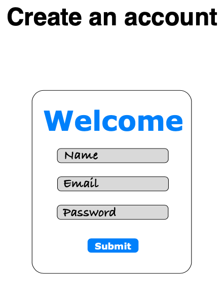
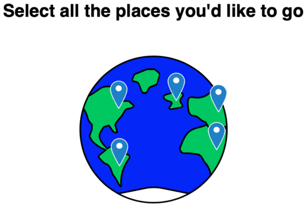
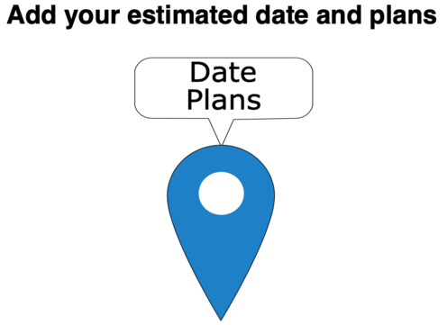
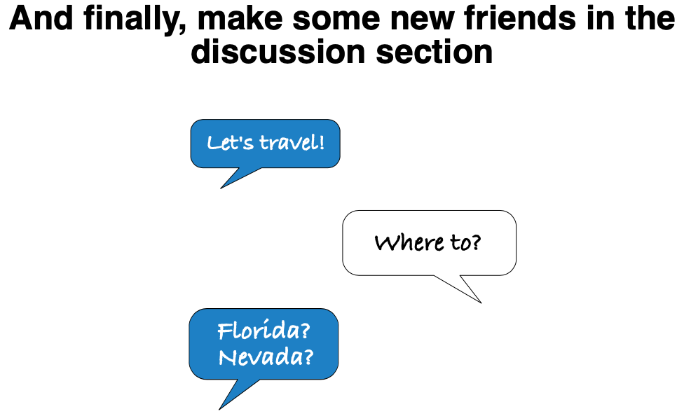

# Travel Buddy

Travel Buddy is a free app to help plan for future travels and talk about your travels with likeminded friends.

Created using React, Node.js, and PostgreSQL

Link to [Travel Buddy](https://choosealicense.com/licenses/mit/)

## Installation

```
npm install
npm start
```

## Usage








## Support
If any bugs/errors are found, please feel free to contact me through the websites 'Contact Me' form and I'll reply a.s.a.p.

## Roadmap
* [x] Reply function in discussions
* [ ] Skeleton Loading
* [ ] Delete markers on map
* [ ] Delete/Edit post
* [ ] Lazy loading for images
* [ ] Add Accessibility
* [ ] Loading animation between pages
* [ ] Dark Mode
* [ ] Group markers by custom categories
* [ ] Forgot password
* [ ] Store feature
* [ ] Sign In with Google, Facebook, Apple

## License
[MIT](https://choosealicense.com/licenses/mit/)